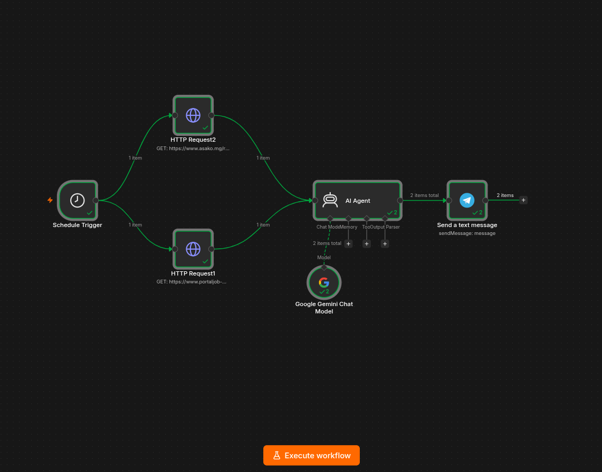

<div align="center">

# 🤖 n8n — Automation Hub

**Plateforme d'automatisation auto-hébergée, pilotée par l'IA**  
*Déploiement Docker · Exposition publique via ngrok · Workflows intelligents*

[](https://n8n.io)
[](https://docs.docker.com/compose/)
[](https://ngrok.com)
[](https://ai.google.dev)
[](https://t.me/+H1eXvqQblnNiNDJk)

</div>

---

## 📌 Vue d'ensemble

Ce dépôt est mon **hub personnel d'automatisation n8n**, déployé en auto-hébergement avec Docker et exposé publiquement via ngrok. Il regroupe des workflows IA que je construis pour automatiser des tâches réelles : veille d'emploi, scraping intelligent, notifications, et plus encore.

> **🎯 Pour les recruteurs** : Ce projet illustre ma maîtrise de l'automatisation, de l'IA générative (Google Gemini), de l'intégration d'APIs, et du déploiement DevOps avec Docker. Chaque workflow est un cas concret et fonctionnel.

> **🛠️ Pour les développeurs** : Vous trouverez ci-dessous toutes les instructions pour déployer votre propre instance n8n et importer mes workflows.

---

## 📋 Sommaire

- [🏗️ Architecture](#️-architecture)
- [⚙️ Installation & Déploiement](#️-installation--déploiement)
- [🔐 Configuration](#-configuration)
- [🚀 Démarrage](#-démarrage)
- [🤖 Workflows](#-workflows)
  - [1. Job Finder — Veille emploi IT à Madagascar](#1-job-finder--veille-emploi-it-à-madagascar)
- [📡 Commandes utiles](#-commandes-utiles)
- [🔒 Sécurité](#-sécurité)

---

## 🏗️ Architecture

```
Internet
   │
   ▼
[ngrok tunnel]  ←──────────────────────────┐
   │                                       │
   ▼                                       │
[n8n Container]  (port 5678)               │
   ├── Workflows & Triggers                │
   ├── AI Agent (Google Gemini)            │
   ├── Sandbox Service (sandbox-api:8080)  │
   ├── Web Search (searxng:8080)           │
   └── Intégrations (Telegram, etc.)  ─────┘
         │
         ▼
  Données persistées sur ~/.n8n
```

**Stack technique :**
| Composant | Rôle |
|---|---|
| `n8n` | Moteur d'automatisation no-code/low-code |
| `Docker Compose` | Orchestration multi-conteneurs |
| `n8n AI Sandbox` | Environnement isolé d'exécution de code pour l'assistant IA |
| `SearXNG` | Moteur de recherche web auto-hébergé pour l'IA |
| `ngrok` | Exposition publique sécurisée (webhooks, UI) |
| `Google Gemini` | Modèle LLM pour l'analyse et extraction IA |
| `Telegram Bot` | Canal de notification des résultats |

---

## ⚙️ Installation & Déploiement

### Prérequis

- [Docker](https://docs.docker.com/get-docker/) ≥ 24
- [Docker Compose](https://docs.docker.com/compose/install/) ≥ 2
- Un compte [ngrok](https://ngrok.com/) avec un tunnel actif
- *(Optionnel)* Un bot Telegram + une clé API Google Gemini pour les workflows IA

### Étapes

```bash
# 1. Cloner le dépôt
git clone https://github.com/MandaHarou/n8n-docker.git
cd n8n-docker

# 2. Créer le fichier de configuration
cp .env.example .env

# 3. Remplir les variables (voir section Configuration)
nano .env

# 4. Lancer toute la stack n8n en arrière-plan
docker compose up -d --remove-orphans

# 5. Vérifier que les conteneurs tournent
docker compose ps
```

---

## 🔐 Configuration

Toutes les variables sensibles sont dans `.env` **(jamais commité)**. Copiez `.env.example` et renseignez chaque valeur :

| Variable | Description | Exemple |
|---|---|---|
| `N8N_BASIC_AUTH_ACTIVE` | Active l'auth HTTP Basic | `true` |
| `N8N_BASIC_AUTH_USER` | Nom d'utilisateur | `admin` |
| `N8N_BASIC_AUTH_PASSWORD` | Mot de passe solide | `MonMotDePasse!` |
| `N8N_ENCRYPTION_KEY` | Clé de chiffrement des credentials | *(générer avec `openssl rand -hex 32`)* |
| `N8N_SANDBOX_VERSION` | Version des images sandbox | `1.3.4` |
| `SANDBOX_API_KEYS` | Clé d'API du service sandbox | *(clé aléatoire hex 32)* |
| `SANDBOX_API_RUNNER_REGISTRATION_TOKEN` | Token de registre runner sandbox | *(clé aléatoire hex 32)* |
| `SANDBOX_RUNNER_API_KEYS` | Clé API pour le runner | *(clé aléatoire hex 32)* |
| `N8N_SANDBOX_SERVICE_URL` | URL interne du service sandbox | `http://sandbox-api:8080` |
| `N8N_SANDBOX_SERVICE_API_KEY` | Clé d'accès n8n vers sandbox | *(même valeur que `SANDBOX_API_KEYS`)* |
| `SEARXNG_SECRET` | Clé secrète pour SearXNG | *(clé aléatoire hex 32)* |
| `N8N_HOST` | Domaine ngrok public | `xyz.ngrok-free.dev` |
| `N8N_PORT` | Port interne n8n | `5678` |
| `N8N_PROTOCOL` | Protocole | `https` |
| `N8N_WEBHOOK_URL` | URL de base des webhooks | `https://xyz.ngrok-free.dev/` |
| `N8N_CORS_ALLOW_ORIGIN` | Origine CORS autorisée | `https://xyz.ngrok-free.dev` |
| `N8N_CORS_ALLOW_METHODS` | Méthodes HTTP autorisées | `GET,POST,OPTIONS` |
| `N8N_CORS_ALLOW_HEADERS` | Headers autorisés | `Content-Type,Authorization` |

**Générer une clé de chiffrement sécurisée :**
```bash
openssl rand -hex 32
```

---

## 🚀 Démarrage

```bash
# Démarrer
docker compose up -d

# Voir les logs en temps réel
docker compose logs -f n8n
```

Accédez à l'interface via votre tunnel ngrok :
```
https://<N8N_HOST>
```
> 💡 En local : `http://localhost:5678`

Identifiants : ceux définis dans `.env` (`N8N_BASIC_AUTH_USER` / `N8N_BASIC_AUTH_PASSWORD`)

---

## 🤖 Workflows

> Les workflows sont disponibles dans le dossier [`Template/`](./Template/). Pour les importer dans n8n : **Settings → Import Workflow → sélectionner le fichier `.json`**.

---

### 1. Job Finder — Veille emploi IT à Madagascar

> **Fichier** : [`Template/jobFinder_Workflow.json`](./Template/jobFinder_Workflow.json)

Un agent IA qui scrape chaque matin les offres d'emploi IT disponibles à Madagascar et envoie un résumé personnalisé sur Telegram.

#### 📸 Aperçu du workflow



> 👉 **[Voir le résultat en direct sur Telegram](https://t.me/+H1eXvqQblnNiNDJk)**

#### 🔄 Comment ça fonctionne

```
⏰ Schedule Trigger (08h01)
        │
        ├──► 🌐 HTTP Request → portaljob-madagascar.com  (scraping HTML)
        │
        └──► 🌐 HTTP Request → asako.mg                 (scraping HTML)
                    │
                    ▼
        🧠 AI Agent (Google Gemini)
           → Analyse le HTML brut
           → Extrait uniquement les offres IT/Web/Data/Cyber
           → Formate : Titre · Entreprise · Lieu · Contrat · URL
                    │
                    ▼
        📲 Telegram Bot → envoi du résumé dans le groupe
```

#### 🧰 Nœuds utilisés

| Nœud | Type | Rôle |
|---|---|---|
| `Schedule Trigger` | Trigger | Déclenche le workflow à 08h01 chaque jour |
| `HTTP Request1` | HTTP | Scrape portaljob-madagascar.com |
| `HTTP Request2` | HTTP | Scrape asako.mg |
| `AI Agent` | LangChain Agent | Analyse et filtre les offres avec Gemini |
| `Google Gemini Chat Model` | LLM | Modèle de langage (sous-nœud de l'agent) |
| `Send a text message` | Telegram | Envoie le résumé dans le groupe Telegram |

#### 🔑 Credentials nécessaires pour le réutiliser

- **Google Gemini API** → [Obtenir une clé](https://ai.google.dev/)
- **Telegram Bot Token** → [Créer un bot avec @BotFather](https://t.me/BotFather)
- Renseigner votre `chatId` Telegram dans le nœud `Send a text message`

---

## 📡 Commandes utiles

```bash
# Arrêter le conteneur
docker compose down

# Redémarrer après modification du .env
docker compose down && docker compose up -d

# Mettre à jour n8n vers la dernière version
docker compose pull && docker compose up -d

# Accéder au shell du conteneur
docker exec -it n8n sh

# Sauvegarder les données n8n
tar -czf n8n_backup_$(date +%Y%m%d).tar.gz ~/.n8n
```

---

## 🔒 Sécurité

Ce projet applique les bonnes pratiques suivantes :

- 🔐 **Authentification HTTP Basic** sur toutes les routes
- 🔑 **Clé de chiffrement** pour les credentials stockés dans n8n
- 🌐 **CORS restreint** à l'origine ngrok uniquement
- 📁 **Variables sensibles** isolées dans `.env` (jamais commité)
- 🚫 **`.gitignore`** protégeant `.env`, les données locales et les logs

> ⚠️ **Important** : Si votre dépôt est public, changez immédiatement `N8N_BASIC_AUTH_PASSWORD` et `N8N_ENCRYPTION_KEY` si ceux-ci ont déjà été exposés dans un commit précédent.

---

## 📁 Structure du projet

```
n8n-docker/
├── docker-compose.yml          # Définition du service n8n
├── .env                        # 🔒 Variables sensibles (NON commité)
├── .env.example                # Template de configuration (commité)
├── .gitignore                  # Fichiers exclus du dépôt Git
├── jobfinder_workflow.png      # Capture d'écran du workflow
├── README.md                   # Ce fichier
└── Template/
    └── jobFinder_Workflow.json # Export du workflow Job Finder
```

---

<div align="center">

**Projet personnel — Libre d'utilisation et d'adaptation**  
*D'autres workflows seront ajoutés régulièrement* ✨

</div>
